# Netimate

[](https://github.com/sjdigiovanni/netimate/actions/workflows/ci.yml)


[](https://github.com/sjdigiovanni/netimate/blob/main/LICENSE)


> **Netimate – a lightweight, async‑first network‑automation toolkit that feels as friendly as a REPL but scales like a platform.**


> ⚠️ **This project is in beta.** Expect bugs, incomplete features, and breaking changes.

---

## Table of Contents
1. [Why Netimate ?](#why-netimate)
2. [Features](#features)
3. [Quick Start](#quick-start)
4. [Configuration](#configuration)
   * [Environment Variables](#environment-variables)
   * [settings.yaml](#settingsyaml)
5. [Usage Examples](#usage-examples)
6. [Architecture](#architecture)
7. [Extending Netimate](#extending-netimate)
8. [Development & Testing](#development--testing)
9. [Contributing](#contributing)
10. [Roadmap](#roadmap)
11. [License](#license)

---

## Why Netimate ?

| Pain point 🥴 | Netimate’s answer 🚀 |
|--------------|----------------------|
| Scripts that crawl device‑by‑device | **Async SSH** – run *hundreds* of commands in parallel |
| “Big‑bang” monolithic platforms | **Modular plugins** – bring only what you need (commands, protocols, repositories) |
| Separate tools for ad‑hoc tasks & CI pipelines | **Unified CLI & Interactive Shell** – same syntax everywhere |
| Manual diff reviews in Notepad | **Snapshot & Diff** – colour‑coded config diffs like Git |
| Wall‑of‑text outputs | **Rich TUI** – live tables & progress bars |

---

## Features

* **Async Scrapli SSH** out of the box  
* **Plugin architecture** – swap or extend protocols, device‑repositories, commands  
* **Interactive shell** *and* single‑shot CLI (same binary)  
* **Snapshots** → **diff** → *approval workflows*  
* **Filesystem template provider** for TextFSM/TTP parsing  
* **Settings from YAML** + runtime overrides via environment variables  
* **100 % Python** – import as a library, use in notebooks, or ship a single Docker image  

---

## Quick Start

```bash
# 1 ∙ Install
pip install "netimate[full]"      # scrapli, netmiko, rich, pyyaml

# 2 ∙ Configure (minimal settings.yaml shown below)
export NETIMATE_CONFIG_PATH=$PWD/settings.yaml

# 3 ∙ Explore
netimate --shell                  # interactive REPL
# or
netimate run show-version on r1
```

---

## Configuration

### Environment Variables

| Variable | Default | Purpose |
|----------|---------|---------|
| `NETIMATE_CONFIG_PATH` | `~/.config/netimate/settings.yaml` | Explicit path to the YAML settings file. |
| `NETIMATE_EXTRA_PLUGIN_PACKAGES` | *(unset)* | Colon‑separated list of dotted package names to scan for third‑party plugins. |

### `settings.yaml`

```yaml
device_repo: yaml               # plugin name
log_level: info                 # off | info | debug
template_paths: ["netimate.plugins.device_commands.templates"]  

# Plugin settings example. Each plugin will get the settings listed below (provided the name matches)
plugin_configs:
  yaml:
    device_file: devices.yaml   # path to inventory
  scrapli_asyncssh:
    transport_options:
      asyncssh:
         known_hosts_file: ~/user/.ssh/file.txt

```

* **`device_repo`** – which `DeviceRepository` plugin to load (`yaml`, `postgres`, etc.).  
* **`plugin_configs`** – per‑plugin config blocks forwarded untouched.  
* **`template_paths`** – extra directories searched by the template provider.

---

## Usage Examples

```bash
Welcome to netimate Shell – type 'exit' to quit.
netimate> run show-version on dev
Running 'show-version' on dev.
Run 'show-version'........
╭──────────────────────────────────────────────────────────────────────────────────────────────────────────────────────────────────────────────────── r1 ─────────────────────────────────────────────────────────────────────────────────────────────────────────────────────────────────────────────────────╮
│ ┏━━━━━━━━━━┳━━━━━━━━━━━━━━━━━━━━━━━━━━━━━━━━━━┳━━━━━━━━━┳━━━━━━━━━━━━━━━━━━━━┳━━━━━━━━━━━━━━━━━━━━━━━━━━━━━━━━━━━━━━┳━━━━━━━━━━━┳━━━━━━━━━┓                                                                                                                                                                 │
│ ┃ HOSTNAME ┃ SOFTWARE_IMAGE                   ┃ VERSION ┃ UPTIME             ┃ RUNNING_IMAGE                        ┃ ROMMON    ┃ RELEASE ┃                                                                                                                                                                 │
│ ┡━━━━━━━━━━╇━━━━━━━━━━━━━━━━━━━━━━━━━━━━━━━━━━╇━━━━━━━━━╇━━━━━━━━━━━━━━━━━━━━╇━━━━━━━━━━━━━━━━━━━━━━━━━━━━━━━━━━━━━━╇━━━━━━━━━━━╇━━━━━━━━━┩                                                                                                                                                                 │
│ │ R1       │ X86_64BI_LINUX-ADVENTERPRISEK9-M │ 17.12.1 │ 3 days, 46 minutes │ /x86_64_crb_linux-adventerprisek9-ms │ Bootstrap │ fc5     │                                                                                                                                                                 │
│ └──────────┴──────────────────────────────────┴─────────┴────────────────────┴──────────────────────────────────────┴───────────┴─────────┘                                                                                                                                                                 │
╰─────────────────────────────────────────────────────────────────────────────────────────────────────────────────────────────────────────────────────────────────────────────────────────────────────────────────────────────────────────────────────────────────────────────────────────────────────────────╯
╭──────────────────────────────────────────────────────────────────────────────────────────────────────────────────────────────────────────────────── r2 ─────────────────────────────────────────────────────────────────────────────────────────────────────────────────────────────────────────────────────╮
│ ┏━━━━━━━━━━┳━━━━━━━━━━━━━━━━━━━━━━━━━━━━━━━━━━┳━━━━━━━━━┳━━━━━━━━━━━━━━━━━━━━┳━━━━━━━━━━━━━━━━━━━━━━━━━━━━━━━━━━━━━━┳━━━━━━━━━━━┳━━━━━━━━━┓                                                                                                                                                                 │
│ ┃ HOSTNAME ┃ SOFTWARE_IMAGE                   ┃ VERSION ┃ UPTIME             ┃ RUNNING_IMAGE                        ┃ ROMMON    ┃ RELEASE ┃                                                                                                                                                                 │
│ ┡━━━━━━━━━━╇━━━━━━━━━━━━━━━━━━━━━━━━━━━━━━━━━━╇━━━━━━━━━╇━━━━━━━━━━━━━━━━━━━━╇━━━━━━━━━━━━━━━━━━━━━━━━━━━━━━━━━━━━━━╇━━━━━━━━━━━╇━━━━━━━━━┩                                                                                                                                                                 │
│ │ R2       │ X86_64BI_LINUX-ADVENTERPRISEK9-M │ 17.12.1 │ 3 days, 46 minutes │ /x86_64_crb_linux-adventerprisek9-ms │ Bootstrap │ fc5     │                                                                                                                                                                 │
│ └──────────┴──────────────────────────────────┴─────────┴────────────────────┴──────────────────────────────────────┴───────────┴─────────┘                                                                                                                                                                 │
╰─────────────────────────────────────────────────────────────────────────────────────────────────────────────────────────────────────────────────────────────────────────────────────────────────────────────────────────────────────────────────────────────────────────────────────────────────────────────╯
netimate> diagnostic dev
Diagnostics on dev.
Diagnostics on dev.......................................
╭────────────────────────────────────────────────────────────────────────────────────────────────────────────────────────────────────────────── r1 diagnostics ───────────────────────────────────────────────────────────────────────────────────────────────────────────────────────────────────────────────╮
│ ┏━━━━━━━━━━━━━━━━━━━━━━━┳━━━━━━━━━━━━━━━━━━━━━━━━━━━━━━━━━━━━━━━━━━━━┓                                                                                                                                                                                                                                      │
│ ┃ Command               ┃ Summary                                    ┃                                                                                                                                                                                                                                      │
│ ┡━━━━━━━━━━━━━━━━━━━━━━━╇━━━━━━━━━━━━━━━━━━━━━━━━━━━━━━━━━━━━━━━━━━━━┩                                                                                                                                                                                                                                      │
│ │ Platform Info         │ X86_64BI_LINUX-ADVENTERPRISEK9-M - 17.12.1 │                                                                                                                                                                                                                                      │
│ │ Interfaces (IP Brief) │ 3 up, 1 down                               │                                                                                                                                                                                                                                      │
│ │ Memory Stats          │ 129.6MB / 831.8MB (15.6%) — OK             │                                                                                                                                                                                                                                      │
│ │ CPU Stats             │                                            │                                                                                                                                                                                                                                      │
│ │ System Logging        │ 20x Notice, 3x Info                        │                                                                                                                                                                                                                                      │
│ └───────────────────────┴────────────────────────────────────────────┘                                                                                                                                                                                                                                      │
╰─────────────────────────────────────────────────────────────────────────────────────────────────────────────────────────────────────────────────────────────────────────────────────────────────────────────────────────────────────────────────────────────────────────────────────────────────────────────╯
╭────────────────────────────────────────────────────────────────────────────────────────────────────────────────────────────────────────────── r2 diagnostics ───────────────────────────────────────────────────────────────────────────────────────────────────────────────────────────────────────────────╮
│ ┏━━━━━━━━━━━━━━━━━━━━━━━┳━━━━━━━━━━━━━━━━━━━━━━━━━━━━━━━━━━━━━━━━━━━━┓                                                                                                                                                                                                                                      │
│ ┃ Command               ┃ Summary                                    ┃                                                                                                                                                                                                                                      │
│ ┡━━━━━━━━━━━━━━━━━━━━━━━╇━━━━━━━━━━━━━━━━━━━━━━━━━━━━━━━━━━━━━━━━━━━━┩                                                                                                                                                                                                                                      │
│ │ Platform Info         │ X86_64BI_LINUX-ADVENTERPRISEK9-M - 17.12.1 │                                                                                                                                                                                                                                      │
│ │ Interfaces (IP Brief) │ 3 up, 1 down                               │                                                                                                                                                                                                                                      │
│ │ Memory Stats          │ 129.6MB / 831.8MB (15.6%) — OK             │                                                                                                                                                                                                                                      │
│ │ CPU Stats             │                                            │                                                                                                                                                                                                                                      │
│ │ System Logging        │ 20x Notice, 3x Info                        │                                                                                                                                                                                                                                      │
│ └───────────────────────┴────────────────────────────────────────────┘                                                                                                                                                                                                                                      │
╰─────────────────────────────────────────────────────────────────────────────────────────────────────────────────────────────────────────────────────────────────────────────────────────────────────────────────────────────────────────────────────────────────────────────────────────────────────────────╯
netimate> run show-ip-interface-brief on dev
Running 'show-ip-interface-brief' on dev.
Run 'show-ip-interface-brief'........
╭──────────────────────────────────────────────────────────────────────────────────────────────────────────────────────────────────────────────────── r1 ─────────────────────────────────────────────────────────────────────────────────────────────────────────────────────────────────────────────────────╮
│ ┏━━━━━━━━━━━━━┳━━━━━━━━━━━━━━┳━━━━━━━━━━━━━━━━━━━━━━━┳━━━━━━━┓                                                                                                                                                                                                                                              │
│ ┃ INTERFACE   ┃ IP_ADDRESS   ┃ STATUS                ┃ PROTO ┃                                                                                                                                                                                                                                              │
│ ┡━━━━━━━━━━━━━╇━━━━━━━━━━━━━━╇━━━━━━━━━━━━━━━━━━━━━━━╇━━━━━━━┩                                                                                                                                                                                                                                              │
│ │ Ethernet0/0 │ 10.10.10.100 │ up                    │ up    │                                                                                                                                                                                                                                              │
│ ├─────────────┼──────────────┼───────────────────────┼───────┤                                                                                                                                                                                                                                              │
│ │ Ethernet0/1 │ 1.1.1.1      │ up                    │ up    │                                                                                                                                                                                                                                              │
│ ├─────────────┼──────────────┼───────────────────────┼───────┤                                                                                                                                                                                                                                              │
│ │ Ethernet0/2 │ 10.10.20.171 │ up                    │ up    │                                                                                                                                                                                                                                              │
│ ├─────────────┼──────────────┼───────────────────────┼───────┤                                                                                                                                                                                                                                              │
│ │ Ethernet0/3 │ unassigned   │ administratively down │ down  │                                                                                                                                                                                                                                              │
│ └─────────────┴──────────────┴───────────────────────┴───────┘                                                                                                                                                                                                                                              │
╰─────────────────────────────────────────────────────────────────────────────────────────────────────────────────────────────────────────────────────────────────────────────────────────────────────────────────────────────────────────────────────────────────────────────────────────────────────────────╯
╭──────────────────────────────────────────────────────────────────────────────────────────────────────────────────────────────────────────────────── r2 ─────────────────────────────────────────────────────────────────────────────────────────────────────────────────────────────────────────────────────╮
│ ┏━━━━━━━━━━━━━┳━━━━━━━━━━━━━━┳━━━━━━━━━━━━━━━━━━━━━━━┳━━━━━━━┓                                                                                                                                                                                                                                              │
│ ┃ INTERFACE   ┃ IP_ADDRESS   ┃ STATUS                ┃ PROTO ┃                                                                                                                                                                                                                                              │
│ ┡━━━━━━━━━━━━━╇━━━━━━━━━━━━━━╇━━━━━━━━━━━━━━━━━━━━━━━╇━━━━━━━┩                                                                                                                                                                                                                                              │
│ │ Ethernet0/0 │ 20.20.20.100 │ up                    │ up    │                                                                                                                                                                                                                                              │
│ ├─────────────┼──────────────┼───────────────────────┼───────┤                                                                                                                                                                                                                                              │
│ │ Ethernet0/1 │ 1.1.1.2      │ up                    │ up    │                                                                                                                                                                                                                                              │
│ ├─────────────┼──────────────┼───────────────────────┼───────┤                                                                                                                                                                                                                                              │
│ │ Ethernet0/2 │ 10.10.20.172 │ up                    │ up    │                                                                                                                                                                                                                                              │
│ ├─────────────┼──────────────┼───────────────────────┼───────┤                                                                                                                                                                                                                                              │
│ │ Ethernet0/3 │ unassigned   │ administratively down │ down  │                                                                                                                                                                                                                                              │
│ └─────────────┴──────────────┴───────────────────────┴───────┘                                                                                                                                                                                                                                              │
╰─────────────────────────────────────────────────────────────────────────────────────────────────────────────────────────────────────────────────────────────────────────────────────────────────────────────────────────────────────────────────────────────────────────────────────────────────────────────╯
netimate>

```

---

## Architecture

```mermaid
graph TD
    %% ─────────────── VIEW ───────────────
    subgraph View_Layer
        CLI["CLI<br/>view/cli/cli.py"]
        Shell["Interactive Shell<br/>view/shell/shell.py"]
    end

    %% ────────── COMPOSITION ────────────
    subgraph Composition
        CompRoot["composition_root<br/>netimate/composition.py"]
    end

    %% ───────── APPLICATION ─────────────
    subgraph Application_Layer
        App["Application<br/>application/application.py"]
    end

    %% ─────── CORE / PLUGIN ENGINE ──────
    subgraph Core_Plugin_Engine
        Runner["Runner<br/>core/runner.py"]
        PluginRegistry["Plugin Registry<br/>core/plugin_engine/plugin_registry.py"]
        PluginLoader["Plugin Loader<br/>core/plugin_engine/loader.py"]
        PluginRegistrar["Plugin Registrar<br/>core/plugin_engine/registrar.py"]
    end

    %% ─────────── INTERFACES ────────────
    subgraph Interfaces
        IF_Repo["DeviceRepository_IF"]
        IF_Proto["ConnectionProtocol_IF"]
        IF_Cmd["DeviceCommand_IF"]
        IF_Settings["Settings_IF"]
    end

    %% ─────────── INFRASTRUCTURE ────────
    subgraph Infrastructure
        ConfigLoader["ConfigLoader<br/>infrastructure/config_loader.py"]
        Settings["Settings<br/>infrastructure/settings.py"]
        Logger["Logging<br/>infrastructure/logging.py"]
        TemplateProvider["FileSystemTemplateProvider<br/>infrastructure/template_provider/filesystem.py"]
    end

    %% ─ CONNECTION PROTOCOL PLUG‑INS ────
    subgraph Connection_Protocol_Plugins
        NetmikoSSH["NetmikoSSHConnection"]
        NetmikoTelnet["NetmikoTelnetConnection"]
        ScrapliAsyncSSH["ScrapliAsyncSSHConnection"]
    end

    %% ─ DEVICE REPOSITORY PLUG‑INS ──────
    subgraph Device_Repository_Plugins
        YAMLRepo["YAMLRepository"]
        PostgresRepo["PostgresRepository"]
    end

    %% ───── DEVICE COMMAND PLUG‑INS ─────
    subgraph Device_Command_Plugins
        EchoTest["echo_test"]
        ShowEnv["show_environment"]
        ShowVer["show_version"]
        ShowInt["show_ip_interface_brief"]
        ShowMem["show_memory_stats"]
        ShowCPU["show_process_cpu"]
        ShowLog["show_logging"]
        ShowRunCfg["show_running_config"]
    end

    %% ───────────── MODELS ───────────────
    subgraph Models
        DeviceModel["Device<br/>models/device.py"]
    end

    %% ──────────── DATA FLOW ─────────────
    CLI --> CompRoot
    Shell --> CompRoot

    CompRoot --> App
    CompRoot --> Logger

    App --> Runner
    App --> IF_Repo
    App --> IF_Proto
    App --> IF_Cmd
    App --> IF_Settings
    App --> TemplateProvider

    Runner --> PluginRegistry
    PluginRegistry --> PluginLoader
    PluginRegistry --> PluginRegistrar

    IF_Repo --> YAMLRepo
    IF_Repo --> PostgresRepo

    IF_Proto --> NetmikoSSH
    IF_Proto --> NetmikoTelnet
    IF_Proto --> ScrapliAsyncSSH

    IF_Cmd --> EchoTest
    IF_Cmd --> ShowEnv
    IF_Cmd --> ShowVer
    IF_Cmd --> ShowInt
    IF_Cmd --> ShowMem
    IF_Cmd --> ShowCPU
    IF_Cmd --> ShowLog
    IF_Cmd --> ShowRunCfg

    IF_Settings --> Settings
    Settings --> ConfigLoader
```

<details>
<summary>Click to view Mermaid diagram</summary>


</details>

---

## Extending Netimate

### Write a new Device Command plugin

```python
# my_plugins/show_cdp_neighbors.py
from netimate.interfaces.plugin.device_command import DeviceCommand

class ShowCdpNeighbors(DeviceCommand):
    table_headers = ["NEIGHBOR", "LOCAL_IF", "REMOTE_IF"]

    def template_file(self) -> str:
        return "ios/cisco_ios_show_cdp_neighbours.textfsm"

    @staticmethod
    def plugin_name() -> str:
        return "show-cdp-neighbors"

    def command_string(self):
        return "show cdp neighbors detail"

    def parse(self, raw: str):
        # convert raw TextFSM record list into rows matching table_headers
        ...
```

```bash
export PYTHONPATH=$PWD/my_plugins
export NETIMATE_EXTRA_PLUGIN_PACKAGES=my_plugins
netimate run show-cdp-neighbors on r1
```

### Other plugin types
* **ConnectionProtocol** – SSH, Telnet, RESTCONF, etc.  
* **DeviceRepository** – YAML, CMDB, IPAM, Postgres…  
See `/plugins/*` for working examples.

---

## Development & Testing

```bash
git clone https://github.com/sjdigiovanni/netimate.git
cd netimate
make setup          # install dev requirements
make ci             # black, isort, mypy, pytest
```

---

## Contributing

Pull requests are welcome! Discussions and RFCs live in the *Discussions* tab.

---

## Roadmap

* Robust error handling
* Bring CLI and Shell to parity
* Multi‑protocol auto‑discovery & topology graph export
* NETCONF / RESTCONF support  
* Web UI (FastAPI + WebSockets)

Track progress on the [projects board](https://github.com/sjdigiovanni/netimate/projects/1).

---

## License

Netimate is licensed under the **Mozilla Public License 2.0** – see [`LICENSE`](LICENSE) for details.
